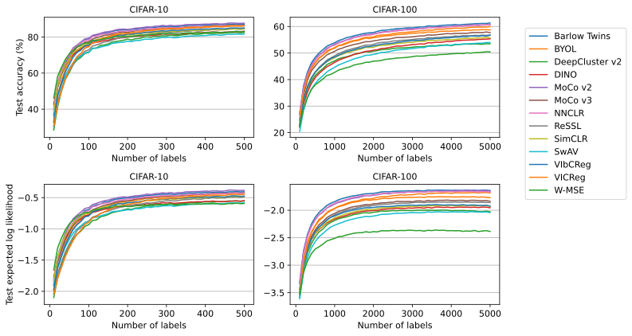

# SSL embeddings of CIFAR-10 and CIFAR-100 images

This repo contains code adapted from [`solo-learn`](https://github.com/vturrisi/solo-learn) for use in [`epig`](https://github.com/fbickfordsmith/epig)'s pipeline for semi-supervised Bayesian active learning.
It might also be useful elsewhere.


## Results

<div align="center">
	
</div>

Predictive performance of a linear classifier trained on an increasing number of labelled embeddings (class-balanced random samples).


## Getting set up

Clone the repo and move into it:

```bash
git clone https://github.com/fbickfordsmith/ssl-embeddings.git && cd ssl-embeddings
```

If you're not using a CUDA device, remove the `cudatoolkit` and `pytorch-cuda` dependencies in `environment.yaml`.

Create an environment using [Mamba](https://mamba.readthedocs.io) (or [Conda](https://conda.io), replacing `mamba` with `conda` below) and activate it:

```bash
mamba env create --file environment.yaml && mamba activate ssl-embeddings
```


## Reproducing the results

Compute embeddings:

```bash
# Use names from https://github.com/vturrisi/solo-learn/blob/main/zoo/cifar10.sh
# except simsiam (causes an error) and supcon (uses labels).
encoders=(barlow byol deepcluster dino mocov2 mocov3 nnclr ressl simclr swav vibcreg vicreg wmse)

for dataset in cifar10 cifar100; do
    for encoder in ${encoders[@]}; do
        echo "Computing embeddings - ${dataset}, ${encoder}"
        python compute_embeddings.py --dataset ${dataset} --encoder ${encoder}
    done
done
```

Evaluate the embeddings in downstream classification:

```bash
encoders=(barlow byol deepcluster dino mocov2 mocov3 nnclr ressl simclr swav vibcreg vicreg wmse)

for dataset in cifar10 cifar100; do
    if [ ${dataset} == "cifar10" ]; then
        n_labels_end=500
    else
        n_labels_end=5000
    fi
    for encoder in ${encoders[@]}; do
        echo "Evaluating embeddings - ${dataset}, ${encoder}"
        for seed in {0..19}; do
            python evaluate_embeddings.py --dataset ${dataset} --encoder ${encoder} --seed ${seed} --n_labels_end ${n_labels_end}
        done
    done
done
```

Plot the results:

```bash
python plot_results.py
```


## Citing this work

[`solo-learn`](https://github.com/vturrisi/solo-learn) repo:

```bibtex
@article{turrisi2022sololearn,
    author = {{Turrisi da Costa}, Victor Guilherme and Fini, Enrico and Nabi, Moin and Sebe, Nicu and Ricci, Elisa},
    year = {2022},
    title = {solo-learn: a library of self-supervised methods for visual representation learning},
    journal = {Journal of Machine Learning Research},
}
```

This repo:

```bibtex
@article{bickfordsmith2024making,
    author = {{Bickford Smith}, Freddie and Foster, Adam and Rainforth, Tom},
    year = {2024},
    title = {Making better use of unlabelled data in {Bayesian} active learning},
    journal = {International Conference on Artificial Intelligence and Statistics},
}
```


### Training methods

Barlow Twins:

```bibtex
@article{zbontar2021barlow,
    author = {Zbontar, Jure and Jing, Li and Misra, Ishan and LeCun, Yann and Deny, St{\'e}phane},
    year = {2021},
    title = {{Barlow Twins}: self-supervised learning via redundancy reduction},
    journal = {International Conference on Machine Learning},
}
```

BYOL:

```bibtex
@article{grill2020bootstrap,
    author = {Grill, Jean-Bastien and Strub, Florian and Altch{\'e}, Florent and Tallec, Corentin and Richemond, Pierre and Buchatskaya, Elena and Doersch, Carl and Pires, Bernardo {\'A}vila and Guo, Zhaohan Daniel and Azar, Mohammad Gheshlaghi and Piot, Bilal and Kavukcuoglu, Koray and Munos, R{\'e}mi and Valko, Michal},
    year = {2020},
    title = {{Bootstrap Your Own Latent}: a new approach to self-supervised learning},
    journal = {Conference on Neural Information Processing Systems},
}
```

DeepCluster v2 and SwAV:

```bibtex
@article{caron2020unsupervised,
    author = {Caron, Mathilde and Misra, Ishan and Mairal, Julien and Goyal, Priya and Bojanowski, Piotr and Joulin, Armand},
    year = {2020},
    title = {Unsupervised learning of visual features by contrasting cluster assignments},
    journal = {Conference on Neural Information Processing Systems},
}
```

DINO:

```bibtex
@article{caron2021emerging,
    author = {Caron, Mathilde and Touvron, Hugo and Misra, Ishan and J{\'e}gou, Herv{\'e} and Mairal, Julien and Bojanowski, Piotr and Joulin, Armand},
    year = {2021},
    title = {Emerging properties in self-supervised vision transformers},
    journal = {International Conference on Computer Vision},
}
```

MoCo v2:

```bibtex
@article{chen2020improved,
    author = {Chen, Xinlei and Fan, Haoqi and Girshick, Ross and He, Kaiming},
    year = {2020},
    title = {Improved baselines with momentum contrastive learning},
    journal = {arXiv},
}
```

MoCo v3:

```bibtex
@article{chen2021empirical,
    author = {Chen, Xinlei and Xie, Saining and He, Kaiming},
    year = {2021},
    title = {An empirical study of training self-supervised vision transformers},
    journal = {International Conference on Computer Vision},
}
```

NNCLR:

```bibtex
@article{dwibedi2021with,
    author = {Dwibedi, Debidatta and Aytar, Yusuf and Tompson, Jonathan and Sermanet, Pierre and Zisserman, Andrew},
    year = {2021},
    title = {With a little help from my friends: nearest-neighbor contrastive learning of visual representations},
    journal = {International Conference on Computer Vision},
}
```

ReSSL:

```bibtex
@article{zheng2021ressl,
    author = {Zheng, Mingkai and You, Shan and Wang, Fei and Qian, Chen and Zhang, Changshui and Wang, Xiaogang and Xu, Chang},
    year = {2021},
    title = {{ReSSL}: relational self-supervised learning with weak augmentation},
    journal = {Conference on Neural Information Processing Systems},
}
```

SimCLR:

```bibtex
@article{chen2020simple,
    author = {Chen, Ting and Kornblith, Simon and Norouzi, Mohammad and Hinton, Geoffrey},
    year = {2020},
    title = {A simple framework for contrastive learning of visual representations},
    journal = {International Conference on Machine Learning},
}
```

SwAV:

```bibtex
@article{caron2020unsupervised,
    author = {Caron, Mathilde and Misra, Ishan and Mairal, Julien and Goyal, Priya and Bojanowski, Piotr and Joulin, Armand},
    year = {2020},
    title = {Unsupervised learning of visual features by contrasting cluster assignments},
    journal = {Conference on Neural Information Processing Systems},
}
```

VIbCReg:

```bibtex
@article{lee2021computer,
    author = {Lee, Daesoo and Aune, Erlend},
    year = {2021},
    title = {Computer vision self-supervised learning methods on time series},
    journal = {arXiv},
}
```

VICReg:

```bibtex
@article{bardes2021vicreg,
    author = {Bardes, Adrien and Ponce, Jean and LeCun, Yann},
    year = {2021},
    title = {{VICReg}: variance-invariance-covariance regularization for self-supervised learning},
    journal = {International Conference on Learning Representations},
}
```

W-MSE:

```bibtex
@article{ermolov2020whitening,
    author = {Ermolov, Aleksandr and Siarohin, Aliaksandr and Sangineto, Enver and Sebe, Nicu},
    year = {2020},
    title = {Whitening for self-supervised representation learning},
    journal = {International Conference on Machine Learning},
}
```